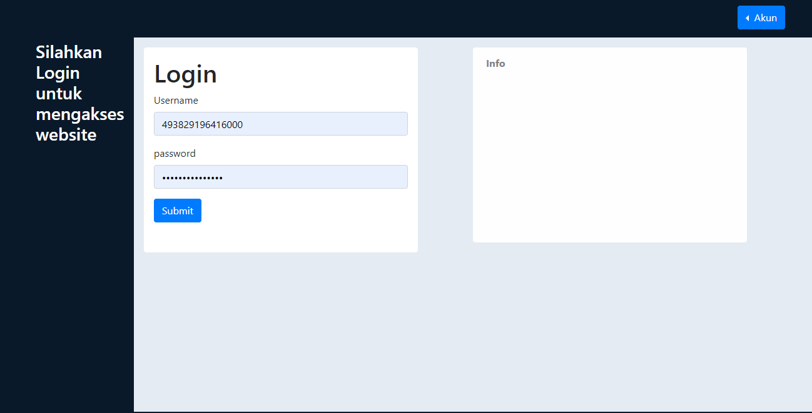

# Aplikasi Elearning



## Instalasi

software requirement:
- [nodejs](https://nodejs.org) versi 12.16.3 LTS
- Database mysql/postgresql

Setelah menginstall software requirement, jalankan file ```install.bat``` untuk menginstall dependecy dan memulai aplikasi.  
setelah aplikasi berjalan, buka browser lalu masuk ke http://localhost:3000

## Fitur

## TODO
- [x] Aksi jawab pertanyaan dari murid di modul konsultasi (guru)
- [x] Halaman untuk membuat pertanyaan kuis (guru)
- [x] Halaman untuk mengerjakan kuis (murid)
- [ ] Tampilkan daftar quis di admin
- [ ] Modul Forum